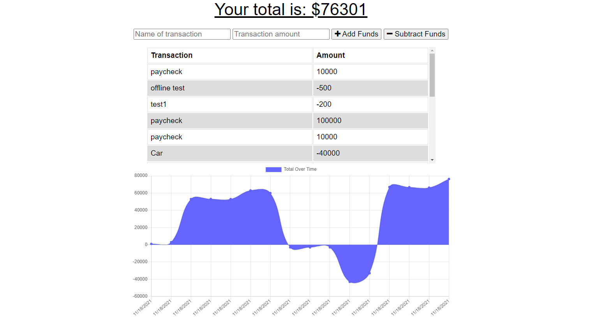

# Online/Offline Budget Tracker
  ## Description
  A budget tracker that is able to add and subtract funds. If the user does not have a connection to the internet it will be updated once the user is back online

  ## Table of Contents
  - [Installation](#installation)
  - [Usage](#usage)
  - [License](#license)
  - [How to Contribute](#contributing)
  - [Tests](#tests)
  - [Questions](#questions)

  ## Installation
  No installation required

  ## Usage
  Go to the deployed application on heroku linked below and add/remove funds

  ## License
  MIT

  ## How to Contribute

  ## Link
  https://uoft-budget.herokuapp.com/

  ## Screenshot
  

  ## About Me/Contact Me
  GitHub Link: [GitHub](https://github.com/MichaelDigi)

  Email: (Michaeld2211@gmail.com)
